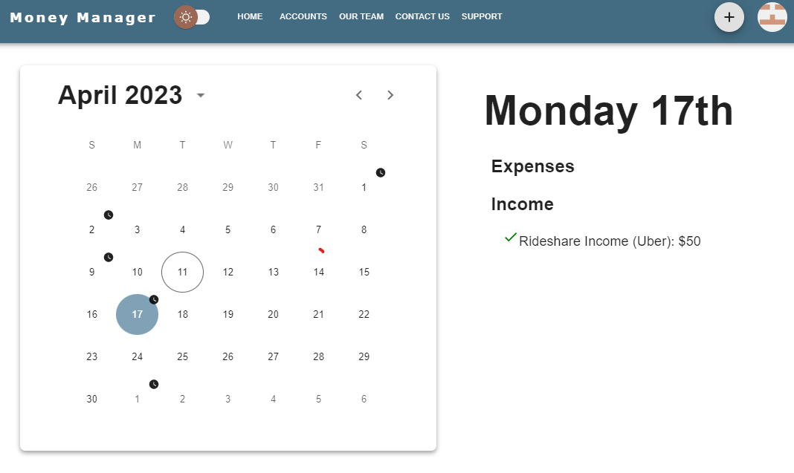

This is a [Next.js](https://nextjs.org/) project bootstrapped with [`create-next-app`](https://github.com/vercel/next.js/tree/canary/packages/create-next-app).

# Money Manager #
### Money Manager was created for use as a personal finance management application, for use ###
### either on mobile, tablet, or desktop screens. ###



### shell ###
### Copy code ###
```
$ git clone https://github.com/Trevor5008/MoneyManager
$ cd project
$ npm install
```
### migrate and seed db ###
```
$ npm run migrate
$ npm run seed
$ npm run dev
```

## Usage
### To get started, first fill out the .env.example file with your credentials
### Once completed, remove the '.example' extension and save the file 
### (be sure to include .env in your .gitignore file)


### Technologies Used

#### Next.js
#### React.js
#### Prisma ORM
#### MySQL 
#### NextAuth.js
#### Material UI
#### Axios
